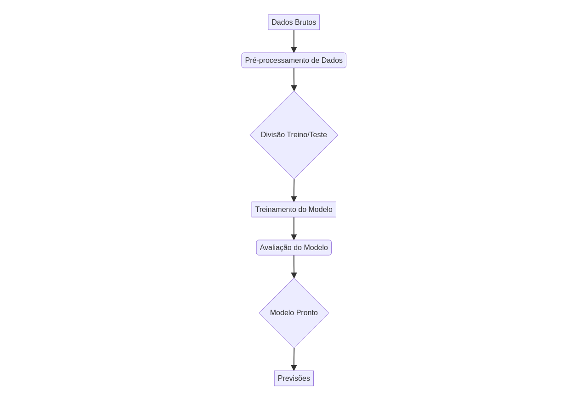

# data-science-pro-workflow




## Overview

This repository presents a professional data science workflow, demonstrating best practices for code organization, unit testing, and documentation. The goal is to provide a robust and scalable template for Machine Learning projects.

## Features

- **Project Structure:** Clear organization with `src/`, `tests/`, `docs/`.
- **ML Workflow:** Example of data preprocessing, model training, and evaluation.
- **Unit Tests:** Test coverage to ensure code functionality.
- **Documentation:** Bilingual READMEs, architecture diagrams, and detailed instructions.

## Technologies


## Installation

To set up the development environment, follow these steps:

1. Clone the repository:
   ```bash
   git clone https://github.com/GabrielDemetriosLafis/data-science-pro-workflow.git
   cd data-science-pro-workflow
   ```

2. Create and activate a virtual environment (recommended):
   ```bash
   python -m venv venv
   source venv/bin/activate  # Linux/macOS
   .\venv\Scripts\activate   # Windows
   ```

3. Install dependencies:
   ```bash
   pip install -r requirements.txt
   ```

## Usage

To run the example workflow:

```bash
python src/dsworkflows/workflow.py
```

To run the unit tests:

```bash
pytest tests/test_workflow.py
```

## Authorship

Developed by Gabriel Demetrios Lafis.
