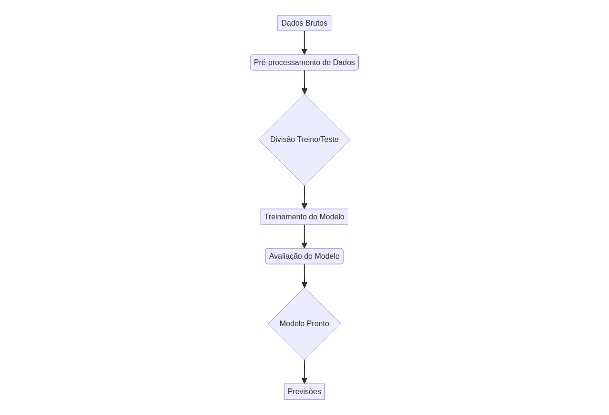

# data-science-pro-workflow



## Visão Geral

Este repositório apresenta um fluxo de trabalho profissional de ciência de dados, demonstrando as melhores práticas para organização de código, testes unitários e documentação. O objetivo é fornecer um modelo robusto e escalável para projetos de Machine Learning.

## Funcionalidades

- **Estrutura de Projeto:** Organização clara com `src/`, `tests/`, `docs/`.
- **Fluxo de Trabalho de ML:** Exemplo de pré-processamento, treinamento e avaliação de modelo.
- **Testes Unitários:** Cobertura de testes para garantir a funcionalidade do código.
- **Documentação:** READMEs bilíngues, diagramas de arquitetura e instruções detalhadas.

## Tecnologias


## Instalação

Para configurar o ambiente de desenvolvimento, siga os passos abaixo:

1. Clone o repositório:
   ```bash
   git clone https://github.com/GabrielDemetriosLafis/data-science-pro-workflow.git
   cd data-science-pro-workflow
   ```

2. Crie e ative um ambiente virtual (recomendado):
   ```bash
   python -m venv venv
   source venv/bin/activate  # Linux/macOS
   .\venv\Scripts\activate   # Windows
   ```

3. Instale as dependências:
   ```bash
   pip install -r requirements.txt
   ```

## Uso

Para executar o fluxo de trabalho de exemplo:

```bash
python src/dsworkflows/workflow.py
```

Para executar os testes unitários:

```bash
pytest tests/test_workflow.py
```

## Autoria

Desenvolvido por Gabriel Demetrios Lafis.
