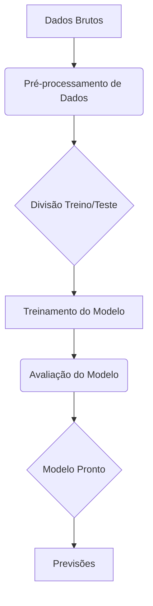

```mermaid
graph TD
    A[Dados Brutos] --> B(Pré-processamento de Dados)
    B --> C{Divisão Treino/Teste}
    C --> D[Treinamento do Modelo]
    D --> E(Avaliação do Modelo)
    E --> F{Modelo Pronto}
    F --> G[Previsões]
```
